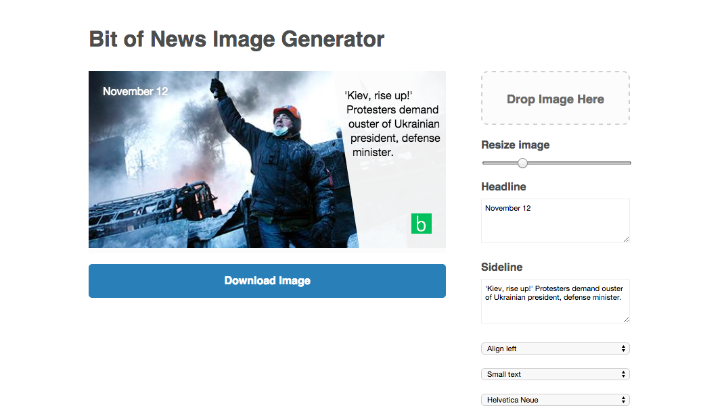

# Bit of News image editor

This is an editor for the top image of the daily Bit of News email.

It's forked from Vox's [meme project](https://github.com/voxmedia/meme). All build files and Gem dependency have been stripped out. It's not just static html/js files.

Contributors: Yuri Victor, Joshua Benton, Matt Montgomery, Ivar Vong, Steve Peters, Flip Stewart, Greg MacWilliam.

## What's new in version 2.0?

* Refactored into a formal MV* app.
* Fixed bugs with rendering state and repeat drag-n-drop images.
* Improved initial rendering with loaded web fonts.
* Improved cross-origin options: both for base64 images and CORS.
* Highly (and easily!) customizable editor and theme options.
* Watermark selector.

## Install

* `git clone https://github.com/voxmedia/meme.git`
* Open editor.html in your browser! That's it :)

## Customization

### Configuration

Settings and controls are configured through `assets/settings.js`. The [settings file](https://github.com/voxmedia/meme/blob/master/source/javascripts/settings.js.erb) has ample comments to document configuration.
